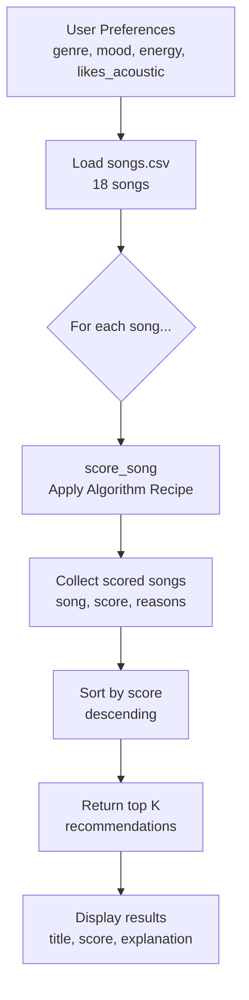

# 🎵 Music Recommender Simulation

## Project Summary

This project simulates how a music platform like Spotify or TikTok recommends songs to users. It uses a content-based filtering approach — meaning it compares the attributes of songs (like genre, mood, and energy) directly against a user's taste profile to generate personalized suggestions. Unlike collaborative filtering (which relies on what other users listened to), this system works entirely from the song's own features.

---

## How The System Works

Real-world recommenders like Spotify combine two main techniques. Collaborative filtering finds users with similar listening history and recommends what they liked. Content-based filtering analyzes the features of songs themselves — tempo, energy, mood — and matches them to what a user has enjoyed before. This simulation focuses on content-based filtering.

**Song features used:**
- `genre` — the musical category (pop, lofi, rock, jazz, etc.)
- `mood` — the emotional tone (happy, chill, intense, focused, etc.)
- `energy` — a 0.0–1.0 score of how energetic the song feels
- `valence` — a 0.0–1.0 score of how positive or upbeat the song is
- `tempo_bpm` — beats per minute

**UserProfile stores:**
- `favorite_genre` — the genre they prefer most
- `favorite_mood` — the mood they want to match
- `target_energy` — their preferred energy level (0.0–1.0)
- `likes_acoustic` — whether they prefer acoustic sounds

**Scoring rule:**
Each song gets a score based on how closely it matches the user's preferences:
- Genre match → +3 points
- Mood match → +2 points
- Energy closeness → up to +2 points (1 - abs difference)
- Valence closeness → up to +1 point
- Acoustic bonus → +1 point if user likes acoustic and acousticness > 0.6

**Ranking rule:**
All songs are scored individually, then sorted from highest to lowest score. The top k songs are returned as recommendations.

## Algorithm Recipe

| Feature | Points | Notes |
|---|---|---|
| Genre match | +3.0 | Strongest signal of taste |
| Mood match | +2.0 | Second strongest signal |
| Energy closeness | up to +2.0 | `2.0 * (1 - abs(song_energy - target_energy))` |
| Valence closeness | up to +1.0 | Rewards positivity match |
| Acoustic bonus | +1.0 | Only if user likes acoustic AND song acousticness > 0.6 |

## Data Flow



## Expected Biases

- **Genre dominance** — genre is worth 3 points vs mood's 2, so a genre match will always outweigh a perfect mood match
- **Filter bubble risk** — if a user's favorite genre dominates the catalog, they will rarely see other 

### Setup

1. Create a virtual environment:

   ```bash
   python3 -m venv .venv
   source .venv/bin/activate
   ```

2. Install dependencies:

   ```bash
   pip install -r requirements.txt
   ```

3. Run the app:

   ```bash
   python -m src.main
   ```

### Running Tests

```bash
pytest
```

---

## Experiments You Tried

*(To be filled in after implementation)*

---

## Limitations and Risks

- Only works on a tiny 10-song catalog
- Does not understand lyrics or language
- May over-favor one genre if the catalog is imbalanced
- Treats all users with the same scoring weights regardless of listening history

---

## Reflection

*(To be filled in after completing the model card)*

---

## Model Card

[**Model Card**](model_card.md)